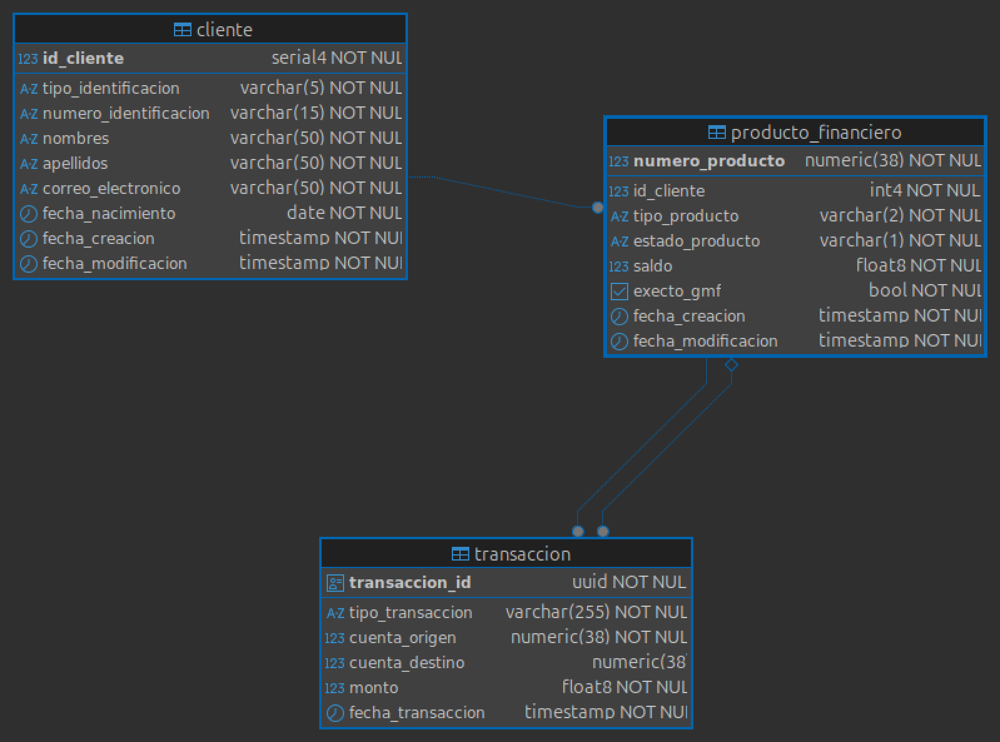

# financiero-backend
Proyecto prueba tecnica - Flypass

## Requisitos para ejecucion del proyecto
- Docker - para ejecutar base de datos postgresql como contenedor, tambien para el caso de ejecutar todo el proyecto en contenedor
- JDK Java 21 

### Iniciar docker para ejecutar base de datos
Iniciar instancia docker, solo el servicio de postgresql:

```shell
docker compose -f docker-compose.yaml --profile db up -d 
```

### iniciar aplicacion spring boot
```shell
./mvnw compile spring-boot:start
```

### Creacion de Base de datos 

Al iniciar la primera vez, se ejecutya script de sql que genera estructura y agrega datos de prueba. Este script se encuentra en la ruta: `resource/db/changelog/ `

### Modelo entidad relacion 

